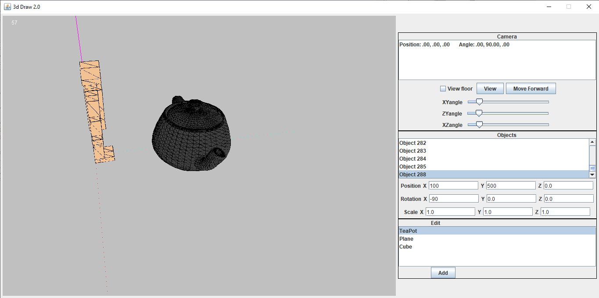
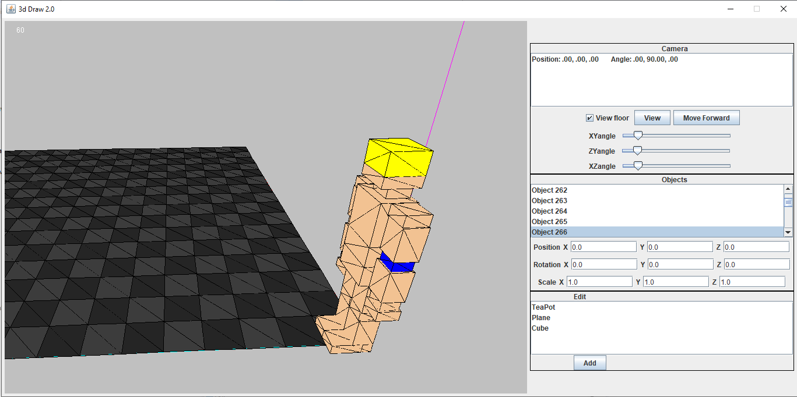
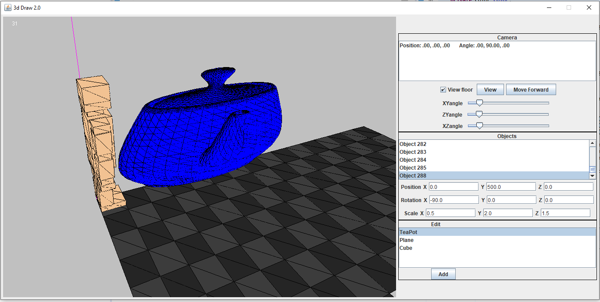
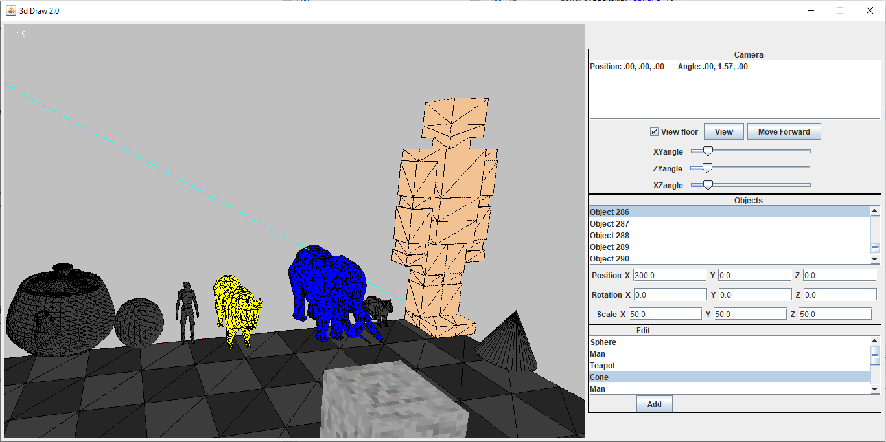

# Java3DEngine

A custom 3D game rendering engine built using Java AWT (Abstract Window Toolkit) and Swing. All 3D logic is built from scratch. Each rendered object is rendered with triangles which are made up of vertices and indices. The renderer will iterate the indices in groups of three and draw a triangle from the vertices of those indices. The vertices-indices reduces the memory of 3D objects.

Each triangle is draw onto a buffered image by splitting a triangle into a flat bottom and flat and horizontal lines are drawn to fill triangle with Bresenham's line algorithm. The lines are drawn onto a buffered image by setting each pixel with a x, y and z coordinate. A z-Buffer array stores the z coordinate of the last drawn pixel and a pixel will only be drawn if its z coordinate is smaller than the last drawn pixel and larger than and equal to 0. The position of the triangle is determined by the camera and the object that holds the vertices and indices. The position of the triangle is translated, rotated and scales by the containing object and then translated and rotated by the camera with rotational matrices.

3D objects can be loaded from a .obj file of vertices and indices. As seen from the teapot which was loaded from a file.

The camera can moved and adjusted with the keyboard and mouse. The camera moves in the direction its facing with the "W" key, back with the "S" key, Left with the "A" Key and right with the "D" Key. The camera can rotate left and right with the left and right arrow keys. It ran face up and down with the l

The camera responds to the following user input:
* "W" Key: Move camera in the direction it's facing
* "A" Key: Move camera left of the direction its facing
* "S" Key: Mouse camera backwards of the direction it's facing
* "D" Key: Move camera right of the direction it's facing
* Left Arrow Key: Rotate the camera left
* Right Arrow Key: Rotate the camera right
* Up Arrow Key: Rotate the camera up
* Down Arrow Key: Rotate the camera down
* "Q" Key: Rotate the camera counter clock wise
* "E" Key: Rotate the camera clock wise
* Space Key: Move the camera up the z axis
* Shift Key: Move the camera down the z axis
* "." Key: Increase camera field of view
* "," Key Decrease camera field of view
* Mouse Move: Highlights a highlightable polygon
* Mouse Drag (Right and middle mouse button): Moves the camera relative to the dragging motion
* Mouse Wheel: moves the camera forward/backwards

The JPanel on the right allows managing the cameras, objects and adding new objects in the application. The JList lists all cameras and allow the user to select a camera. The "View" button allows the user to switch perspective to the selected camera. The "Move forward" button moves the selected camera in the direction its facing. The 3 sliders allow adjusting the selected camera's view angle. 

The user can hover their cursor over objects which will be colored yellow and the blue when clicked and selected. Users can also select an object with the JList and edit the object's position, rotation and scale with the JTextFields.

Users can add objects into the environment by selecting from the Mesh JList and clicking the add button.

Objects can also be rendered with a texture from a PNG file. The textures are rendered using affine texture mapping. The texture is defective at certain angles due to perspective. Perspective correction is needed to improve the texture rendering. 

Display of imported objects from .obj files. Models were made by me in Blender and obj file were edits to be in "Vertex indices" only format.

