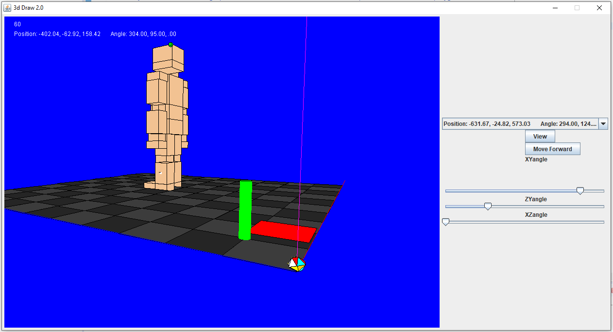
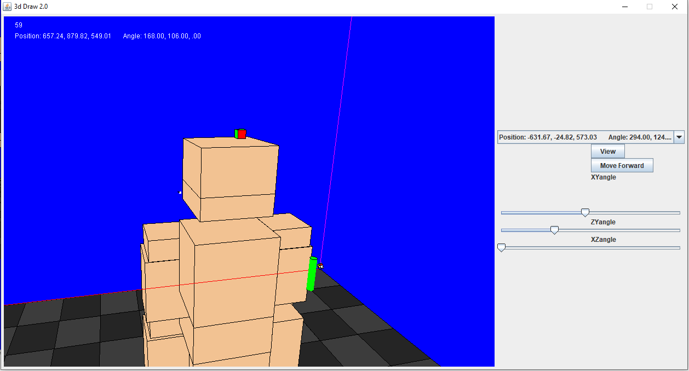
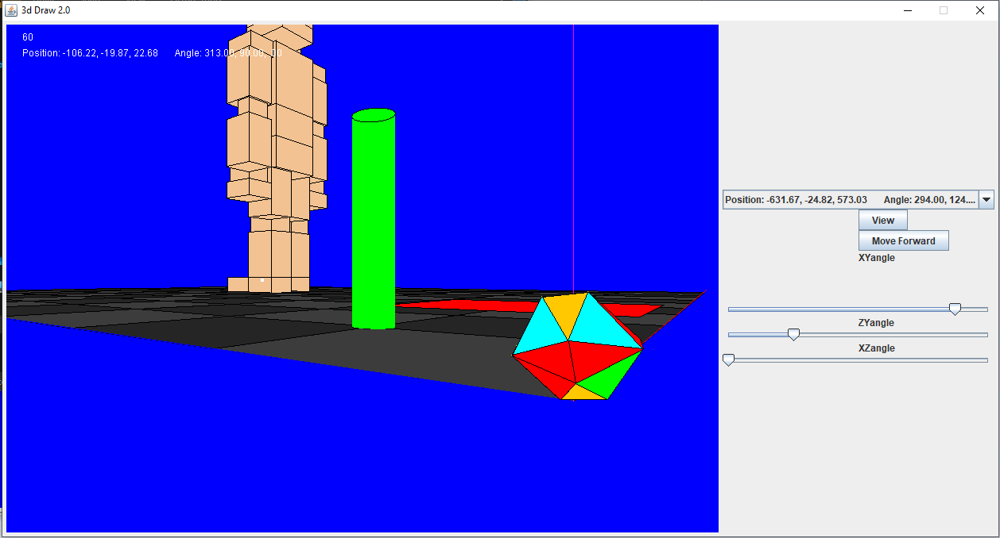

# Java3DEngine

A custom 3D game rendering engine built using Java AWT (Abstract Window Toolkit) and Swing. All 3D logic is built from scratch but mostly relies on Java Graphics Object to draw a shape from a given set of coordinates. The positions of the polygons that are rendered are recalculating on a render method based on the Camera position and angles. All polygons are "rotated" around the camera by using 3 Matrix multiplication to rotate around the axis XY, XZ, and ZY. 

The camera can moved and adjusted with the keyboard and mouse. The camera moves in the direction its facing with the "W" key, back with the "S" key, Left with the "A" Key and right with the "D" Key. The camera can rotate left and right with the left and right arrow keys. It ran face up and down with the l

The camera responds to the following user input:
* "W" Key: Move camera in the direction it's facing
* "A" Key: Move camera left of the direction it's facing
* "S" Key: Mouse camera backwards of the direction it's facing
* "D" Key: Move camera right of the direction it's facing
* Left Arrow Key: Rotate the camera left
* Right Arrow Key: Rotate the camera right
* Up Arrow Key: Rotate the camera up
* Down Arrow Key: Rotate the camera down
* "Q" Key: Rotate the camera counter clock wise
* "E" Key: Rotate the camera clock wise
* Space Key: Move the camera up the z axis
* Shift Key: Move the camera down the z axis
* "." Key: Increase camera field of view
* "," Key Decrease camera field of view
* Mouse Move: Highlights a highlightable polygon
* Mouse Drag (Right and middle mouse button): Moves the camera relative to the dragging motion
* Mouse Wheel: moves the camera forward/backwards

The JPanel on the right allows managing the cameras in the application. The drop down allow the user to select a camera. The "View" button allows the user to switch perspective to the selected camera. The "Move forward" button moves the selected camera in the direction its facing. The 3 sliders allow adjusting the selected camera's view angle. All cameras are green cubes with a red side representing where the camera is facing.

In the center of the screen is a Reticle and a rectangle rendered on z=0. The rectangle on z=0 is the beginning progress on translating the mouse position into a 3d coordinate to help users to draw new polygons.

The prebuilt shapes include a human figure made up of several cubes, a cylinder, and a 20 sided polyhedron (icosahedron). The icosahedron was work in progress for rendering spheres.

Future versions would include allowing users to draw shapes. Add spheres and round shapes, give polygons textures, allow lighting and shadows, and more user configuration.
